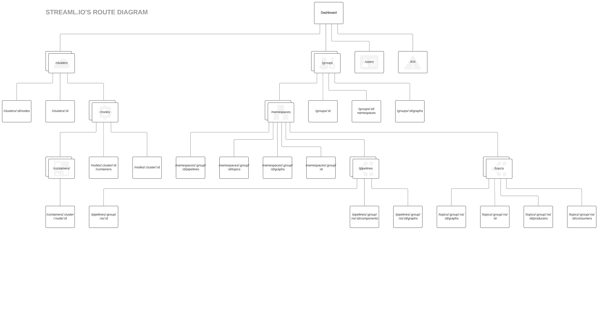

## Local development

Required software:

* [node 8+](https://nodejs.org/en/)
* [yarn](https://yarnpkg.com/lang/en/)

Running the dev server:

* (first time only) Copy the `env.js.sample` file to a new file `env.js`, update the configuration settings as necessary:

  ```
  // The API entry point
  API_BASE: 'http://35.186.225.106/api/v1',

    // The path where the application will be running at, set this if the application is running
    // on a subdirectory: if desired URL is www.streamlio.com/path/to/app, PUBLIC_PATH should
    // be '/path/to/app'
    PUBLIC_PATH: '/',

    // Whether the app requires users to authenticate or it's run publicly
    ENABLE_AUTH: process.env.ENABLE_AUTH || true,
  ```

* (first time only) Run `yarn` at the project root to download and install all dependencies
* Optionally, run `yarn test` to run the test suite
* Run `yarn run dev` to start the development server. The application will be available at http://localhost:3030/

Each time a file is updated in the project, the dev server will recompile the application and update the browser tab where it is running automatically. In order for this process to be fast, some actions where taken that impact the way development should be tackled:

* TypeScript type checking is disabled while running the dev server, for this reason, we recommend using an IDE with TypeScript integration (such as WebStorm)
* TSLint is also disabled in this setting, same recommendation applies

## Production builds & Deployment

A production-ready build can be triggered by running `yarn run build` on the console. 

After the command finished, several files will be found at `dist/`:
* `index.html` Entry point of the applcation
* `main.[hashcode].js` The bundled application's code
* `main.[hashcode].map` The bundled apllications's code source maps 
* `main.[hashcode].js.map` The bundled applicatio's CSS
* `css.[hashcode].css.map` The bundled application's CSS source maps
* `assests/` Directory containing static assets like images and fonts
* `icons-[hash]/ Directory containg favicons for compatability with multiple platforms

All of these files but the `*.map` files are needed for a successful production deployment.

During this procedure both TypeScript and TSLint will run and type check, any errors encountered will cause the compilation to exit with a non-zero exit code (i.e. failing automated builds). 
TSLint can be configured to throw warnings instead of errors, which may come handy from time to time, to do this change the `tslint-loader`'s `emitErrors` option to `false` inside `webpack.config.js`.

There are many options that can be configured to fine-tune production builds, please refer to the documentation of each tool used during compilation for further details:
* [webpack](https://webpack.js.org/)
* [css-loader](https://github.com/webpack-contrib/css-loader)
* [postcss-loader](https://github.com/postcss/postcss-loader)
* [sass-loader](https://github.com/webpack-contrib/sass-loader)
* [style-loader](https://github.com/webpack-contrib/style-loader)
* [awesome-typescript-loader](https://github.com/s-panferov/awesome-typescript-loader)
* [url-loader](https://github.com/webpack-contrib/url-loader)
* [file-loader](https://github.com/webpack-contrib/file-loader)
* [HtmlWebpackPlugin](https://github.com/jantimon/html-webpack-plugin)
* [ExtractTextPlugin](https://github.com/webpack-contrib/extract-text-webpack-plugin)
* [UglifyJSPlugin](https://github.com/webpack-contrib/uglifyjs-webpack-plugin)
* [FaviconsWebpackPlugin](https://github.com/jantimon/favicons-webpack-plugin)
* [webpack-dev-server](https://github.com/webpack/webpack-dev-server)

### Server configuration 
The files created during compilation are mostly self-sufficient, as soon as they are delivered to a browser the application will run and no further interaction with the server is required.
However, the server must ensure that even during 404s, the `dist/index.html` is served. 

Some examples of how to achieve this:

#### Apache
```apache
FallbackResource /index.html
```
https://httpd.apache.org/docs/trunk/mod/mod_dir.html#fallbackresource

#### Nginx
```nginx
location / {
    try_files $uri /index.html;
}
```
http://nginx.org/en/docs/http/ngx_http_core_module.html#try_files

#### Express (node)
```js
const app = express())
app.use(fallback('index.html', { root: __dirname + '/dist' }))
```
https://www.npmjs.com/package/express-history-api-fallback

## Useful commands
* `yarn test` Runs test suite
* `yarn run test:coverage` Runs test suite with coverage information
* `yarn run test:watch` Runs test suite in watch mode, any change to test or source files will re-run the affected tests
* `yarn run clean` Deletes the contents of `dist/` folder where compiled files are temporarily placed
* `yarn start` Runs a production-like node server that serves the files created during `yarn run build`. Use this to test the production build locally.

## Technology Stack

This project is written using the following technologies:

* [TypeScript 2](https://www.typescriptlang.org/)
* [React 16](https://reactjs.org/)
* [Redux](https://redux.js.org/)
* [Redux Saga](redux-saga.js.org)
* [D3](https://d3js.org/)
* [React-Table](https://react-table.js.org)
* [Plottable](http://plottablejs.org/)
* [BlueprintJS](http://blueprintjs.com/)
* [SCSS](http://sass-lang.com/)
* [Foundation Sites XY-Grid](https://foundation.zurb.com/sites/docs/xy-grid.html)
* [Webpack](https://webpack.js.org/)
* [Prettier](https://prettier.io/)

### Browser support

* Chrome: last 2 versions
* Firefox: last 2 versions
* Safari: last 2 versions
* Edge: last 2 versions
* Internet Explorer 11
* iOS: version 10.3 and above

During compilation, vendor prefixes are added automatically to ensure compatibility with these targets. See [autoprefixer](https://github.com/postcss/autoprefixer).

## File structure

```
.
├── README.md
├── env.js.sample      # Sample configuration file for the app settings
├── env.ci.js          # Configuration file used for Continuous Integration environments
├── index.html         # The HTML template used during compilation to generate the entry point for the application
├── package.json       # Main project file containing metadata and the dependency list. https://docs.npmjs.com/files/package.json
├── postcss.config.js  # PostCSS config file. https://github.com/postcss/postcss-loader#configuration
├── server.js          # Basic Node HTTP server for serving the app
├── test-setup.ts      # Testing setup boilerplate for React/enzyme
├── tsconfig.json      # TypeScript config file. https://www.typescriptlang.org/docs/handbook/tsconfig-json.html
├── tslint.json        # TSLint config file. https://palantir.github.io/tslint/usage/tslint-json/
├── webpack.config.js  # Webpack config file. Controls all compilation aspects for both local and prod builds
├── yarn.lock          # Dependency lock file. https://yarnpkg.com/lang/en/docs/yarn-lock/
├── dist               # Destination path for the production compilation
├── app.json           # Dokku configuration file. Can be safely removed if not running on Dokku
└── src
    ├── App.tsx        # Root React component
    ├── constants.ts   # Misc constants and helper functions
    ├── definitions.ts # Typings for 3rd party dependencies who lack types
    ├── index.dev.tsx  # Main entry point of the application for the local dev server
    ├── index.prod.tsx # Main entry point of the application for the production version
    ├── index.tsx      # Main entry point of the webpack compilation
    ├── routes.ts      # List of all routes in the application
    ├── types.ts       # Helper type functions
    ├── __tests__      # Test related directories. There are many __test__ directories across the
    │                    source folder, local to the code they test
    ├── api            # All API integration functions go here
    ├── assets
    │   ├── fonts      # Custom fonts and icon fonts for the application
    │   ├── images     # Static images and icons
    │   └── scss       # Cross-cutting SCSS and 3rd party overrides
    ├── components     # Most React components for all of the different modules of the application
    ├── scenes         # React components for each route/page. Separation from the components folder is purely for
    │                    organization and searchability purposes
    ├── store          # Business logic lives here. Mostly redux and redux-saga code.
    └── util           # Miscellaneous shared functions
```

## Components

### Graphs

There are 2 types of graphs `LineGraph` and `StackGraph`, both composed by one or several `Line` plots (Plottable).

##### Line Graph

Since all its uses are custom, this component is never implemented as is, but as a base for other components, that's why is in the `/internal` folder.

There are 3 different implementations of this component: `PipelineGraph`, `NamespaceGraph` and `RangeGraph`. At the end, all of them will look the same, but internally every single one has its own data requirements and validations.

Any of the mentioned implementations can be used by `MultipleGraphsLayout` for dashboard metrics or by `EntityDetailGraphsLayout` for detail graphs, to build the desired final component.

##### Stack Graph

Just as `Line Graph` this component isn't used as is, but it's implemented by `StackGraphWithLabelLayout`.

This component is used by any entity type (topology, namespace, etc) because it's based on metrics, it just needs a type to know how to group the Prometheus query (e.g. `by (topology)`).

This Graph will always show the top 10 results (topk)

##### Prometheus Metrics

Both `LineGraph` an `StackGraph` datasets come from Prometheus.

To get metrics, depending on type, you need to call any `trigger` action in `metrics-actions.ts`. Currently there are 5 `trigger` functions:

* triggerRequestPipelineMetrics => Will inject `pipeline={$id}` in the prometheus query
* triggerRequestNamespaceMetrics => Will inject `namespace={$id}` in the prometheus query
* triggerQueryMetrics => Will inject the whole query in the prometheus, using `query` instead of `queryrange`
* triggerRangeQueryMetrics => Customizable query like `triggerQueryMetrics` but using `queryrange` instead `query`
* triggerStackQueryMetrics => Customizable query like `triggerRangeQueryMetrics` but will inject `topk(10)` around prometheus query


Note: `triggerRangeQueryMetrics` could be able to replace any queryrange query like `triggerRequestPipelineMetrics`, `triggerRequestNamespaceMetrics` and `triggerStackQueryMetrics`, as long as enough params are passed to it

### Tables

There are 2 types of tables `Regular Tables` which are the most common, and `Grouped Tables` which have grouped rows that can be expanded upon clicking on the expand button. 

Both tables implement the `Table` component which in time implements `react-table`.

#### Pagination

Pagination is implemented separately with the `Pager` and  `CommonListToolbar` components, which are connected through the HOC `withPagination`.

#### Regular Tables

Both `Regular Tables` and `Grouped Tables` need to create a list of `columns` with different props, this is a description of said columns:

* id: `string` a unique identifier for this column.
* accessor: `(row) => value` assign the returned value to a `value` prop on the list member.
* Cell: `({ value, original, aggregated }) => component` describes how the cell value will be rendered, 
it will receive the current member of the list on an `original` property plus a `value` prop defined by the accessor if defined,
and an `aggregated` prop on a `Grouped Table` that will be true if this is the row with grouped values.
* Header: component which will render the header of this column.
      

#### Grouped Tables

Additionally, you might want to create `Grouped Tables` which require a new 'pivot' column. 
This column should have the `className: 'pivot-cell'` and its `PivotValue: () => ' '` to render correctly, 
then when calling the `Table` component we need to pass this column id as an array value on the `pivotBy` prop, 
additionally, the `accessor`of this column will define the value that the list will be grouped by.

The other columns will need  to define the following property

* aggregate: `(values, rows) => aggregatedValue` this defines the value for the grouped row, the `values` argument contains an array of all the values defined by the accessor while `rows` argument contains the original list

You should either provide this prop on the columns array or check if the `aggregated` value is true before trying to access the `original` property on the `Cell` renderer.

### Operations

##### How to create an trigger operation (e.g. deactivate/trigger/etc)?
For a simple dialog operations like `deactivate pipeline`
* create the dialog operation calling `makeOperationWithDialog with 2 generic params
  * The first interface contains the params that the action is going to use, normally it'll be only: `id` and `requester`, where `id` is e.g. pipeline id and `requester` is a unique id that represents this solo call for this operation,
  I mean if you call 5 times `deactivate` for the same pipeline because for some reason the API call is failing, you have to make sure that requester is different each time,
  otherwise redux will think that is the previous call and no operation will be triggered.

  * The second interface contains the options for the dialog. E.g. a destructive operation may send `requireConfirmation: true`

* Once that operation is created, we need to pass the operation that is going to be trigger from the modal (e.g. `triggerDeactivatePipeline) and `operation` which contains the result of the triggered operation (e.g. `getPipelineDeactivateState) for this we'll use `connect`.
Also if there is any previous param that needs data/computation before is added to the operation, this is the place (e.g. `requester` needs to call a unique id generator).

* That's it.


For a more complex component (e.g. ApplyTTL)

* You still need to use `makeOperationWithDialog`, but know you need to do the following:

  * Pass a custom `dialogBody`

  * Add custom properties to the first generic interface for the operation like `ttl`

  * Maybe `onSuccess` prop, but that's will depend on the operation.

  * That's it


*Note*: All the operations require one child to trigger the operation.

##### Modifying Operations

The most complex operations are implemented in a separate method. These operations generally involve multi-step (i.e. "Wizard") forms and potentially complex input validation.

The following current modifying operations exist:

* GroupCreate (`src/components/Operations/GroupModify.tsx`)
* GroupUpdate (`src/components/Operations/GroupModify.tsx`)
* NamespaceCreate (`src/components/Operations/NamespaceModify.tsx`)
* NamespaceUpdate (`src/components/Operations/NamespaceModify.tsx`)
* UserCreate (`src/components/Operations/UserModify.tsx`)
* UserUpdate (`src/components/Operations/UserModify.tsx`)

Internally each of these components follows a similar method of construction. There is a base UI component (e.g. `NamespaceModify`), which then gets used to generate specific operations (e.g. `NamespaceUpdate`).

The base UI component consists of a `<FormDialog>` and one or more child `<Step>` components (`src/components/Dialog/FormDialog.tsx`). Each `<Step>` component represents a single step in building up the modification operation payload. Each step requires three things, a title, a content component and optionally a validator function. The content component is used to render the UI for that particular form step. Currently all content components exist in `src/components/Operations/internal/EntityComponents.tsx`. The validator function (found in `src/components/Operations/internal/validators.ts`) is responsible for checking that the collected user input on a given step is valid. This information is used to display errors and prevent the user from progressing to the next step if there errors on the current one.

The base UI component is then extended via a HOC, `makeCrudOperation` (`src/components/Operations/internal/CrudOperation.tsx`), which creates a specific operation (e.g. create/update). This HOC takes as arguments the base UI component, an action to trigger the actual operation, and a function which should return the redux state of the current operation. For example, taking the NamespaceModify UI component and creating a specific NamespaceCreate operation is accomplished in the following manner:

```
export const NamespaceCreate = makeCrudOperation(
  BaseUiComponent, // UI form component for performing the operation
  triggerCreateNamespace, // redux action for creating a namespace
  (state: State) => getNamespaceCreateState(state) // function for retrieving the state of the operation
)
```

## Code structure

* Component hierarchy flows top-down from the components located in the `src/scenes` directory.
* All dependencies between components are explicitly stated as part of a component's file, the exception to this are SCSS files, which are included automatically if present inside `src/components` or `src/scenes`
* It's recommended to use a good IDE that can handle auto-importing for you

### Updating styles

Most styling is done via SCSS, even layout. The recommended approach is to go look for a specific component in React DevTools, and then find the relevant SCSS file for that component, which usually has the same name as the component you want to update. For example, if the component you want to change is named `ListSceneTpl`, the styling file to update will be `ListSceneTpl.scss`

If however, the styling is for 3rd party components such as Blueprint, or you want to change global styles, you should look for the relevant files in `src/assets/scss`.

It's important to note that `src/assets/scss/common` should not contain any CSS-generating code, only mixins and variables, as it is included in two separate compilation units (`src/assets/scss/index.scss` and `src/assets/scss/vendor/index.scss`).

### How data gets into the screen

1. A React component renders on the screen. During this phase, the component asks for all the data it needs [dispatching actions to the redux store](https://redux.js.org/docs/basics/DataFlow.html). While data is not yet received, the component either doesn't display on the screen or shows a loading indicator
2. A set of [redux sagas](https://github.com/redux-saga/redux-saga) process the request for data, initiating HTTP calls and dispatching new actions to inform the store that requests are in flight and awaiting response
3. The [reducers](https://redux.js.org/docs/basics/Reducers.html) for the actions dispatched by the saga update the loading state accordingly, once the request comes back, the reducers also put the returned payload in the store for consumption by React components
4. The React component that requested the data receives it from the store, triggering a re-render

### Integrating new API services

* All actual HTTP requests go inside `src/api/[resource-name].ts`. These are mainly functions that receive data and marshall it appropriately for API consumption.
* A set of actionCreators and reducers will need to be created as well. Each HTTP read (i.e. `GET`) call consist of a triggering action (e.g. `triggerRequestSomething`) used by React components to begin the API request process, and a set of 3 actions for the lifecycle of such call (`requestSomethingStarted`, `requestSomethingDone`, `requestSomethingFailed`). These go into `src/store/[resource-name]/[resource-name]-actions.ts` and `src/store/[resource-name]/[resource-name]-reducers.ts`.
* Sagas for listening to the request actions should be created at `src/store/[resource-name]/[resource-name]-reducers.ts`. This is the glue that listens to request from the React side and orchestrate the actual API call
* Finally, a React component needs to dispatch the `triggerRequestSomething`, using [redux's connect()](https://github.com/reactjs/react-redux/blob/master/docs/api.md#connectmapstatetoprops-mapdispatchtoprops-mergeprops-options)

### Adding new routes

* All routes exist by declaring them in the appropriate context, there isn't a main routes file as with common server routers
* For a simple route like `myapp.com/mynewroute`, you can add a `<Route component={MyNewRouteComponent}>` component (from [react-router](https://reacttraining.com/react-router/web/)) to `src/App.tsx`
* If you want nested routes, follow the route's component hierarchy and nest new `<Routes>` as needed, refer to [Nested Routes](https://reacttraining.com/react-router/core/guides/philosophy/nested-routes)


## Testing

The unit test framework of choice is [jest](https://facebook.github.io/jest/). When running `yarn test`, the jest runner searches for files matching the following regex: `/__tests__/.+\\.test\\.(ts|tsx)$`.
Then compiles and runs each file separately reporting all successes and failures.

In order for a unit test to be detected, put it in a location where jest can find it. As a convention, tests are co-located as close as possible to the code they test.

* [Resources and guidelines for writing jest tests](https://facebook.github.io/jest/docs/en/more-resources.html)
*  For testing React components we use [enzyme](https://github.com/airbnb/enzyme)
* Redux reducers/selectors/actions are tested as plain old JS code, as per [the docs](https://redux.js.org/docs/recipes/WritingTests.html)

## Updating and tracking dependencies
Yarn must be used for upgrading dependencies. Running `yarn upgrade` will download the latest version-compatible packages from npm and update the lock file.
One can also run `yarn upgrade-interactive` for a human-friendly interface.

Make sure to run the test suite after any dependencies change. Manual testing is also advised, as all dependencies in TypeScript are statically analyzable, one
can `git grep '[dependency-name]'` to find all places where it is used, facilitating manual testing.

* [Semantic version updates](https://yarnpkg.com/en/docs/dependency-versions)

### Important considerations
* Upgrading `react`, `redux`, `react-router`, `react-redux` and `react-dom` to major versions should be taken with special care, as most of the code depends on them. Be sure to read the release notes and thoroughly test the application after a major version upgrade for any of these libraries.
* Generally speaking, dev dependencies are more or less safe to upgrade to major versions. If there is any incompatibility between modules, the build will fail or produce strange results, which are easily validated after manual testing.
* Updating `typescript` may produce new type errors as the compiler gets smarter, these must be fixed if the upgrade is desired.
* `path-to-regexp` must not be updated, as we try to mirror the version `react-router` uses. If upgrading `react-router` itself, make sure that both the versions of `path-to-regexp` for react router and this application matches.


## Conventions

* Configure prettier to auto-format files on save (this is IDE dependant), or use the CLI before each commit
* Use React props as much as possible, use state sparingly. Props should flow from top-level scene components to child components
* Prefer stateless function components.
* One default exported React component per file.
* Use React's state for ephemeral state that doesn't affect the app globally. For example, a toggle in some UI element.
* Components, classes, and types should be Pascal case (FooBar), everything else (functions, variables etc.) camel case (fooBar).
* Similarly, file names for components and classes should be Pascal case, anything else should be kebab case (foo-bar)
* Import statements must be alphabetized and grouped. See https://palantir.github.io/tslint/rules/ordered-imports/
* Import from the project root (i.e import Component from "src/components") rather than relative to the file (i.e. import Component from "../../../components").
* Stylesheet and test file live next to the files they style/test

### Handling types

* Types should live col-located to the code that uses it. Sometimes it's not possible since they have many dependants and they need to be placed in a shared file. Some examples:

  * Types for React Components should always live in the same file as the component
  * Types for a utility lib that implements some algorithm should live in the same file as the lib
  * Types that define interfaces for other to follows and commonly used types can live
    in their own file if there are many related types so that the total amount of types
    is greater than 2 or 3, as the last resource, you can define a `types.ts` in the most sensible location that makes sense

* The mental model for naming/using types should be something like:

  > Types are no different than any other entity in the code, like functions or constants. They serve the purpose of constraining the code for maintainability & error detection, but otherwise they should not be treated any different than other language constructs, think about it, would you create `functions.js` or a `classes.ts` file to put all your functions/classes in there?`

* Naming scheme is simple:

  * PascalCase (e.g. ComponentName) always
  * Most of the time they should be nouns and not verbs (but occasionally adjectives like `Comparable`)
  * Keep it simple, if you are typing an object that represents a dog, don't name it:
    * 'IDog'
    * 'DogType'
    * 'Quadruped'
      Just name it `Dog`
  * Remember that classes define both a type and a class, so name types like you would name classes.

* Always user `interface` as opposed to `type` except when you aren't allowed by the language

* Export the types if you expect it to be useful for others, but try to keep them not-exported by default

For React components:

* Props: `[COMPONENT_NAME]Props`. InputProps, ErrorMessageProps, etc
* State: `[COMPONENT_NAME]State`. InputState, ErrorMessageState, etc. Should only be defined if the component has any state, otherwise just specify the props (`React.Components<Props>`)

For Higher-Order Components:

* Use this guide to understand how types work in the context of HoCs:
  https://dev.to/danhomola/react-higher-order-components-in-typescript-made-simple
* HoCs are sometimes more complex and require customized types

## Route diagram



[PDF Version](assets/routes.pdf)
